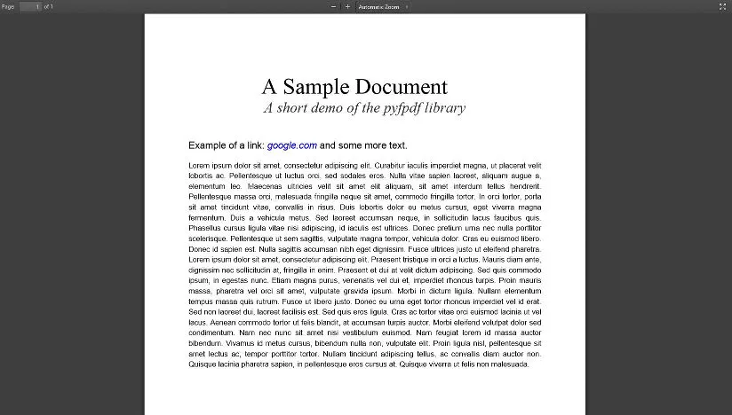

<meta x-title="Programmatic PDF generation"/>

I came across an interesting (and really useful) Python module recently. [PyFPDF](https://code.google.com/p/pyfpdf/) is
a Python port of the popular php .pdf generation library FPDF. Remarkably it is portable and cross platform due to the
nature of the PDF format and uses a grand total of 126kB.

Here is the code for a simple document:

```python
from fpdf import FPDF

pdf = FPDF()
pdf.add_page()
pdf.set_y(30)
pdf.set_margins(20, 20, 20)

pdf.set_font('times', '', 30)
pdf.set_text_color(0, 0, 0)
pdf.cell(0, 10, "A Sample Document", 0, 1, 'C')

pdf.set_font('times', 'I', 20)
pdf.set_text_color(50, 50, 50)
pdf.cell(0, 10, "A short demo of the pyfpdf library", 0, 1, 'C')

pdf.ln()

pdf.set_font('arial', '', 13)
pdf.set_text_color(0, 0, 0)
pdf.write(6, "Example of a link: ")

pdf.set_font('arial', 'I', 13)
pdf.set_text_color(0,0,200)
pdf.write(6, "google.com", "http://google.com")

pdf.set_font('arial', '', 13)
pdf.set_text_color(0, 0, 0)
pdf.write(6, " and some more text.")

pdf.set_font('helvetica', '', 10)
text = "Lorem ipsum dolor sit amet, consectetur adipiscing elit. Curabitur iaculis imperdiet magna, ut placerat velit lobortis ac. Pellentesque ut luctus orci, sed sodales eros. Nulla vitae sapien laoreet, aliquam augue a, elementum leo. Maecenas ultricies velit sit amet elit aliquam, sit amet interdum tellus hendrerit. Pellentesque massa orci, malesuada fringilla neque sit amet, commodo fringilla tortor. In orci tortor, porta sit amet tincidunt vitae, convallis in risus. Duis lobortis dolor eu metus cursus, eget viverra magna fermentum. Duis a vehicula metus. Sed laoreet accumsan neque, in sollicitudin lacus faucibus quis. Phasellus cursus ligula vitae nisi adipiscing, id iaculis est ultrices. Donec pretium urna nec nulla porttitor scelerisque. Pellentesque ut sem sagittis, vulputate magna tempor, vehicula dolor. Cras eu euismod libero. Donec id sapien est. Nulla sagittis accumsan nibh eget dignissim. Fusce ultrices justo ut eleifend pharetra. Lorem ipsum dolor sit amet, consectetur adipiscing elit. Praesent tristique in orci a luctus. Mauris diam ante, dignissim nec sollicitudin at, fringilla in enim. Praesent et dui at velit dictum adipiscing. Sed quis commodo ipsum, in egestas nunc. Etiam magna purus, venenatis vel dui et, imperdiet rhoncus turpis. Proin mauris massa, pharetra vel orci sit amet, vulputate gravida ipsum. Morbi in dictum ligula. Nullam elementum tempus massa quis rutrum. Fusce ut libero justo. Donec eu urna eget tortor rhoncus imperdiet vel id erat. Sed non laoreet dui, laoreet facilisis est. Sed quis eros ligula. Cras ac tortor vitae orci euismod lacinia ut vel lacus. Aenean commodo tortor ut felis blandit, at accumsan turpis auctor. Morbi eleifend volutpat dolor sed condimentum. Nam nec nunc sit amet nisi vestibulum euismod. Nam feugiat lorem id massa auctor bibendum. Vivamus id metus cursus, bibendum nulla non, vulputate elit. Proin ligula nisl, pellentesque sit amet lectus ac, tempor porttitor tortor. Nullam tincidunt adipiscing tellus, ac convallis diam auctor non. Quisque lacinia pharetra sapien, in pellentesque eros cursus at. Quisque viverra ut felis non malesuada."
pdf.ln(10)
pdf.multi_cell(0, 5, text)
```

This generates a document that looks like this:


Relatively simple! It produces a slim and efficient pdf document almost instantaneously.

So far I’m using this to replace Google Docs for certain small documents that need to be regenerated regularly. It also
avoids the sillyness of OpenOffice vs Microsoft Word formatting since I use both Ubuntu and Windows. PyFPDF could be
really useful in future when decent output is required.

Unfortunately, PyFPDF requires many lines to produce a more complicated document. In order to make it more useful, I
think it requires a structured DOM tree of sorts to make it easier to create better structure in the page. If I use this
library more in the future I might start a project to do that.

There are also existing libraries for converting HTML/CSS into PDF. These work well, but I find that HTML/CSS are too
strictly bound to a fluid dimension web layout, whilst documents often need to be fixed to A4. Of course, pick the
solution that fits the problem and works.
