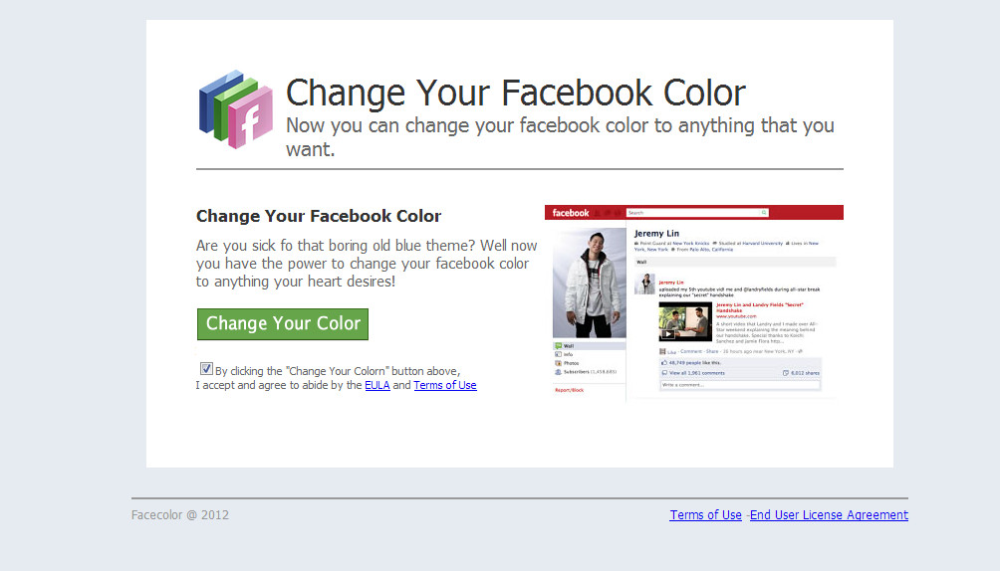
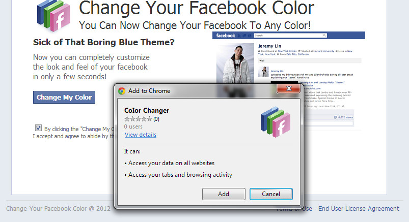

<meta x-title="Malicious Facebook plugin analysis"/>
<meta x-description="(Imported from old blog) Decoding the javascript behind a malicious Facebook plugin."/>

An interesting payload was being passed around Facebook last night. It took the form of an enticing plugin that claimed
to change the colour of one’s Facebook. I first came across it when I was apparently ‘tagged’ in a photo.
The photo looked like this:


The tagged photo advertises a pretty shiny Facebook conversion tool and asks people to click the link. Some things to
note: The layout of Facebook in the image is not current, it is definitely an old layout from before Timeline.

Clicking on the link (Incognito mode!) takes you to this page:



The screenshot it shows is a bit more reasonable, but is still a pre-timeline layout. A big green button lets you
install the plugin itself. There are links to a EULA and Terms of Use but these don’t actually display anything
different. Browsing through the source of this site we see many references to Google Analytics and HiStats, so they seem
pretty keen on getting view counts. Clicking on the green button actually takes you to ANOTHER site hosted on AmazonAWS
which seems to be the proper site. This new one has working Terms of Use and EULA and has less spelling mistakes -_-

Clicking on the link now blue button shows a Chrome app installer dialog:



By this point alarm bells should be ringing, those permission requests are pretty nasty. So now we need to pull the
source code to find out what it does. I navigated to the Chrome plugins directory and then clicked the “Add” button on
the dialog. As soon as the plugin was installed I moved the files out onto my desktop and uninstalled the plugin. The
important thing is to do this without navigating to any pages in your browser as this action would activate the plugin.

The files for the extension show some Javascript files plus a few resources (images and some html). The manifest.json,
which loads a chrome plugin, contains:

```
{
  "background": { "scripts": ["background.js"] },
  "content_scripts": [
    {
      "js": ["script.js", "BlobBuilder.js", "canvas-toBlob.js"],
      "matches": ["http://*/*", "https://*/*"],
      "run_at": "document_end"
    },
    {
      "js": ["jquery.min.js", "jquery.miniColors.js", "content.js"],
      "matches": ["http://*/*", "https://*/*"],
      "run_at": "document_end"
    }
  ],
  "content_security_policy": "script-src 'self' https://ssl.google-analytics.com; object-src 'self'",
  "description": "CoIor Changer",
  "icons": {"16": "icon16.png", "48": "icon48.png", "128": "icon128.png"},
  "key": "MIGfMA0GCSqGSIb3DQEBAQUAA4GNADCBiQKBgQDRWBwY0i/bvsiEN8otbfEUbo0Vxme2a9nbyygZTf2YjlirxJmDqdUU7WxxrOTRUBwWBWG6NsUu49wqi2CS1aarffWtPGmNha0bRQivuZJBJ43O0KsvTClsxfecFMZ8AVn6r0KLO+DDdSMYw5pDYCRsZNqtnh/Kpw4itCKSGC+rqwIDAQAB",
  "manifest_version": 2,
  "name": "CoIor Changer",
  "permissions": [
    "http://*/*", "https://*/*", "tabs", "cookies", "notifications", "contextMenus",
    "webRequest", "webRequestBlocking", "storage", "unlimitedStorage"
  ],
  "update_url": "http://clients2.google.com/service/update2/crx",
  "version": "1.0.4"
}
```

Important things to note:

- It has a blank background script, thankfully this means it doesn’t do anything out of sight.
- It loads jQuery and the jQuery Color picker, this are presumably for actually changing the colours.
- Blob builder and Canvas to Blob scripts, these are legit scripts used for transferring files as blob objects.
- A long permissions list, including access to pretty much everything.
- An update URL! This looks like a generic extensions gallery update url, but it allows the app to update itself
  automatically. This is bad as it could suddenly turn malicious without much change.
- content.js which does all the work.

## Analysing content.js

```content.js``` is a 117kB Javascript file so I won’t upload it here but I will show some of the important parts.

The process starts off innocently enough:

- Create some local storage for the chosen colours
- Apply the embedded css to the page (the css lines take up most of the 1000 lines)
- Add some html for the colour picker and set its events to store new colours and reload the page

So all of the legit work is done in the first 1000 lines or so. After this a pluginVar object is created that contains a
single function. Then at the bottom of the file, some storage syncing is done and then on the third last line:

```javascript
PluginVar.doShit();
```

What this code does:

1. Load more settings from another AmazonAWS hosted json page. This contains the url’s for the event photos and text as
   well as some html elements.
2. Inject jQuery if this is not yet injected
3. Inject a hit counter image
4. If the page is a facebook page then continue otherwise stop.
5. Starts a new www.facebook.com request in order to pull user id from header
6. Upload a new photo. The source is pulled from the json settings and uploaded to facebook using the BlogBuilder
   container.
7. Tag some random number of friends in the photo
8. If event has not been created, create the event and join it
9. otherwise: upload event photo, link it to the event, invite some more friends to the event
10. store a list of all the users friends in the local storage.
11. Clear all notifications (this is a bit weird)
12. If not blogged already: blog it:
13. Make request to blogger.com
14. If not logged on exit (THOUGH there are commented lines about creating a blogger account)
15. otherwise create a new blog!
16. Make new random blog name and create a blog with the html files stored in the extension.
17. Keep trying if there’s a failure.
18. Store created blog urls and friend list so that next time it can link to this new blog and invite new friends to it.

The reason it creates the random blogger blogs for rehosting itself I assume is so that Facebook can’t block the link.
Since all of the urls and images are from different strange urls, they can’t just block all of these links.

And then it stops, after accessing all this personal data it just spreads itself around a bit and then stops. Luckily it
does nothing more malicious than this, for now. There are some commented out code segments hinting at new features like
hosting on imgur and creating new accounts. Sketchy stuff :/

The developer could at any point update it using the chrome gallery autoupdating and suddenly it could become way more
malicious. Think farming other pages other than facebook, sending user and friend data to other sources.

EDIT:

It turns out that the theme itself is perfectly legit. Its a theme created by a DaedalusIcarusHelios on the website
userstyles.org. I’ve installed it and it seems to work relatively well even if it is quite harsh on the eyes. There are
plenty of other themes on that site as well.
