<meta x-title="Building whereismypower.co.za"/>

This post covers the creation of [whereismypower.co.za](http://whereismypower.co.za), a load shedding schedule website I developed as a side project. 

- 25,057 page views over 3 months
- R 99 total cost (excluding free credits)

--------------------

Due to South Africa's crippled and straining power supply, the national power utility (Eskom) has implemented a schedule of load shedding whereby, in times of peak demand, power is shut off in certain areas according to a rotating schedule. There are 4 levels of load shedding severities which are used depending on the amount of consumption that needs to be shed from the national grid.

| Stage | Megawatts to be shed |
|-------|----------------------|
| 1     | 1000MW               |
| 2     | 2000MW               |
| 3A    | 3000MW               |
| 3B    | 4000MW               |

When load shedding was first implemented, the City of Cape Town municipality released a load shedding schedule which divided Cape Town into 16 broad areas. Each area would be switched on or off as a whole and was represented in the schedule as a number (Area 1, Area 2, Area 3 ..). The initial schedule repeated weekly and designated at which times of day each area was shut off depending on the load shedding stage. 

Here is an example of the initial stage 1 and stage 2 timetables:

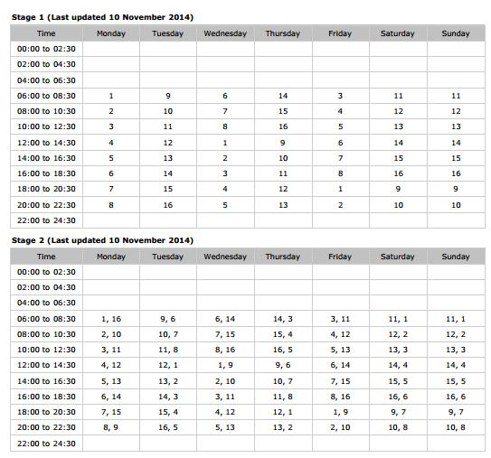

As you can see they are pretty hard to read! Therefore an easy to use website that interpreted and presented this data was a necessity.

## Tech stack overview
I'm most familiar with creating data driven MVC web-apps using `Ruby on Rails`, so that is what I chose for this project. Coupled with `SASS`, `HAML`, and `CoffeeScript` building the website could go pretty quickly. The code was hosted on Github and initially deployed to Heroku. I chose `Postgres` as a database. Other helpful development bits were `RSpec`, `SimpleCov`, `Faker`, and `FactoryGirl` which is a great combination for testing.

## Data collection v1
The initial problem was collecting the data, the schedules had been published as PDF's which are notoriously difficult to extract data from reliably. I wrote a Python script to take copy pasted table data and convert it into a more readable structure. The code below is pretty hacky and very specific to this particular task:

```
import re
from sets import Set

from collections import defaultdict

# schedule name for the current data set
schedule_name = 'schedule3B'

# raw copy pasted data
data = """00:00 to 02:30    9, 1, 15, 7     2, 15, 7, 9     13, 7, 10, 2    7, 10, 4, 13    7, 4, 14, 10    7, 14, 1, 12    7, 14, 1, 12
02:00 to 04:30  10, 2, 16, 8    3, 16, 8, 10    14, 8, 11, 3    8, 11, 1, 14    8, 1, 15, 11    8, 15, 2, 9     8, 15, 2, 9
04:00 to 06:30  11, 3, 13, 5    4, 13, 5, 11    15, 5, 12, 4    5, 12, 2, 15    5, 2, 16, 12    5, 16, 3, 10    5, 16, 3, 10
06:00 to 08:30  1, 16, 6, 14    9, 6, 14, 3     6, 14, 3, 11    14, 3, 11, 8    3, 11, 8, 9     11, 1, 9, 6     11, 1, 9, 6
08:00 to 10:30  2, 10, 7, 15    10, 7, 15, 4    7, 15, 4, 12    15, 4, 12, 1    4, 12, 1, 10    12, 2, 10, 7    12, 2, 10, 7
10:00 to 12:30  3, 11, 8, 16    11, 8, 16, 5    8, 16, 5, 13    16, 5, 13, 2    5, 13, 2, 11    13, 3, 11, 8    13, 3, 11, 8
12:00 to 14:30  4, 12, 1, 9     12, 1, 9, 6     1, 9, 6, 14     9, 6, 16, 3     6, 14, 3, 12    14, 4, 12, 1    14, 4, 12, 1
14:00 to 16:30  5, 13, 2, 10    13, 2, 10, 7    2, 10, 7, 15    10, 7, 15, 5    7, 15, 4, 13    15, 5, 13, 2    15, 5, 13, 2
16:00 to 18:30  6, 14, 3, 11    14, 3, 11, 8    3, 11, 8, 16    11, 8, 14, 4    8, 16, 5, 14    16, 6, 14, 3    16, 6, 14, 3
18:00 to 20:30  7, 15, 4, 12    15, 4, 12, 1    4, 12, 1, 9     12, 1, 9, 6     1, 9, 6, 15     9, 7, 15, 4     9, 7, 15, 4
20:00 to 22:30  8, 9, 5, 13     16, 5, 13, 2    5, 13, 2, 10    13, 2, 10, 7    2, 10, 7, 16    10, 8, 16, 5    10, 8, 16, 5
22:00 to 24:30  12, 4, 14, 6    1, 14, 6, 12    16, 6, 9, 1     6, 9, 3, 16     6, 3, 13, 9     6, 13, 4, 11    6, 13, 4, 11
"""

linere = re.compile(r'(\d\d\:\d\d) to (\d\d\:\d\d)((?:\s+(?:\d+\, )*\d+)*)')

days = ['monday', 'tuesday', 'wednesday', 'thursday', 'friday', 'saturday', 'sunday']

outage_data = defaultdict(lambda: defaultdict(list))

for line in data.splitlines():

    r = linere.match(line)
    if r is not None:

        tfrom = r.group(1)
        tto = r.group(2)

        tto_hour, tto_minute = tto.split(':')
        tto_hour = int(tto_hour)
        tto_minute = int(tto_minute)

        bad_span = tto_hour > 23 and tto_minute > 0
        actual_tto = '00:00' if bad_span else tto

        tstring = "%s-%s" % (tfrom, actual_tto)

        temp = r.group(3).strip().replace(', ', ',')

        if len(temp) > 0:
            day_data = re.sub(r'\s+', ' ', temp).split(' ')
            assert len(day_data) == 0 or len(day_data) == 7

            if len(day_data) == 7:

                outtages = zip(days, day_data)
                for p in outtages:

                    areas = p[1].split(',')
                    for a in areas:

                        outage_data[a][p[0]].append(tstring)

                if bad_span:
                    tstring = "00:00-%02d:%02d" % (tto_hour - 24, tto_minute)

                    outtages = zip(days[-6:] + [days[0]], day_data)
                    for p in outtages:

                        areas = p[1].split(',')
                        for a in areas:

                            outage_data[a][p[0]].insert(0, tstring)
```

This data was then inserted into the database in the following model:

| Field                 | Type          |
|-----------------------|---------------|
| id                    | integer (pk)  |   
| schedule_id           | integer       | 
| area_id               | integer       |
| monday_outages       | string        | 
| tuesday_outages      | string        |
| wednesday_outages    | string        |
| thursday_outages     | string        |
| friday_outages       | string        |

The `outages` columns have a string of the form `"00:00-00:30|04:00-06:30|10:00-12:30|16:00-18:30"` indicating the different times that area would be load shed on that day under the given schedule. This schema worked well in the beginning when the website was still simple but was changed over time in order to support more interesting queries.

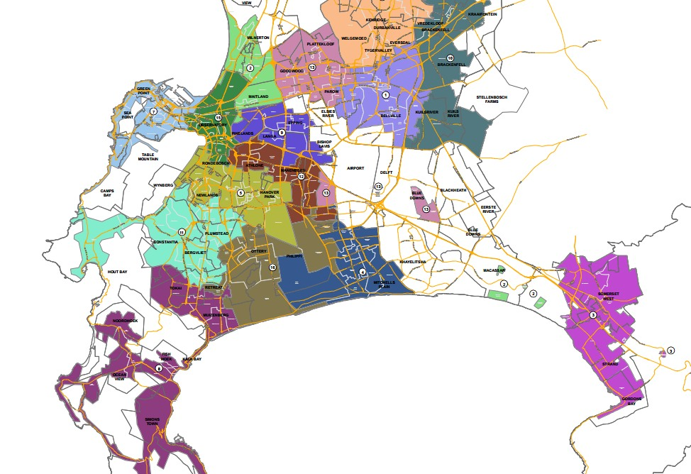

The most difficult part of the data collection was extracting the irregular 2d areas from the PDF that represented the 16 areas on the map. I wanted to create my own slippy map (pan & zoom) to show the areas so that users could easily identify exactly which area they fell into. The great thing about the PDF provided by the City was that the **area map was still in SVG format!** I used `Inkscape`, a popular vector graphics editor to load in the PDF and isolate the SVG elements representing the map. I then exported it into a text based representation (*.fx) that could be easily parsed. I worked out a basic understanding of how the format worked I managed to extract the coordinates of the points representing the polygons in page-space. These still needed to be converted into gps coordinate space in order to be shown on a Google Maps canvas. This step was accomplished by identifying 3 key points that I could identify the real gps coordinates for, and building a matrix transform that mapped the `x, y` coordinates of the SVG points into `latitude, longitude` coordinates. After processing all the points in this way, I could get accurate maps of each load shedding area.

```
from numpy import *

# mapping from svg page coordinates into GPS coordinates
matchpoints = [
    [(292.704875, 1975.7033075000002), (18.33421, -34.01172)],
    [(764.212575, 1982.0071825000002), (18.50671, -34.01514)],
    [(857.7943625, 1657.9653700000001), (18.54184, -33.91674)]
]

class WorldTransformer(object):
    def __init__(self, matchpoints):
        K = matrix([
            [a[1][0] for a in matchpoints],
            [a[1][1] for a in matchpoints]
        ])

        M = matrix([
            [a[0][0] for a in matchpoints],
            [a[0][1] for a in matchpoints],
            [1, 1, 1]
        ])

        self.T = K * M.getI()

    def transform(self, x, y):
        d = self.T * matrix([[x], [y], [1]])
        return d.item(0), d.item(1)

    def transform_all(self, points):
        return [self.transform(x, y) for x,y in points]
```

I created a Python script to do all this heavy lifting. As an input it loaded the `*.fx` data, and as an output it generated the Javascript file that serves the data for a Google Map. Functionality also included finding the center of each collection of points in order to display a flag with the area number.

## Basic website functionality
Initially the website had 4 main pages:

1. A main page where the user can pick their area
2. The area page where the user can pick the current schedule
2. The schedule page displaying the weekly schedule for the area and stage
3. The map page where users could see a visual representation of Cape Town's load shedding areas.


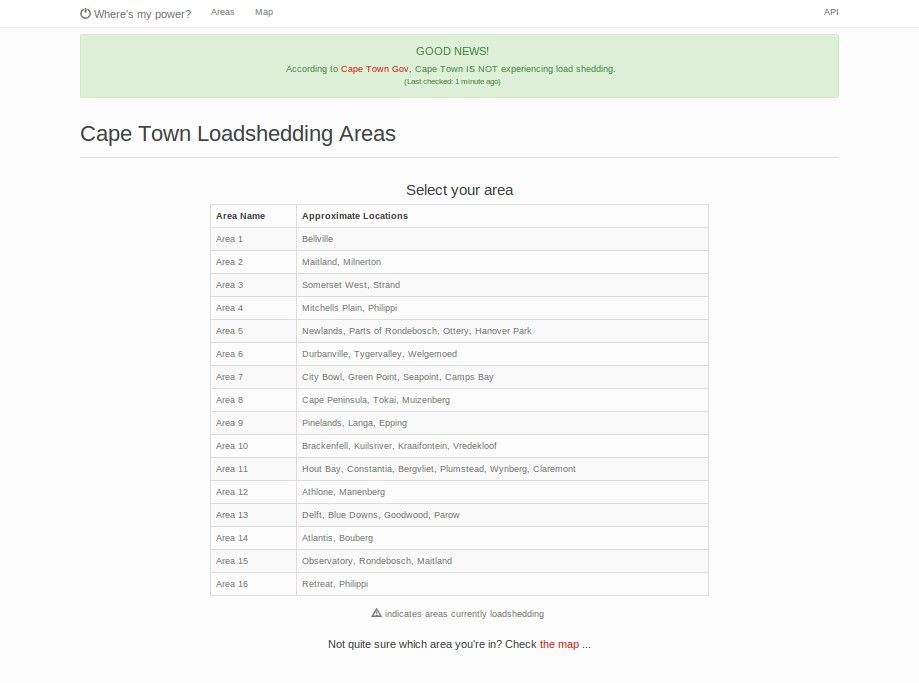
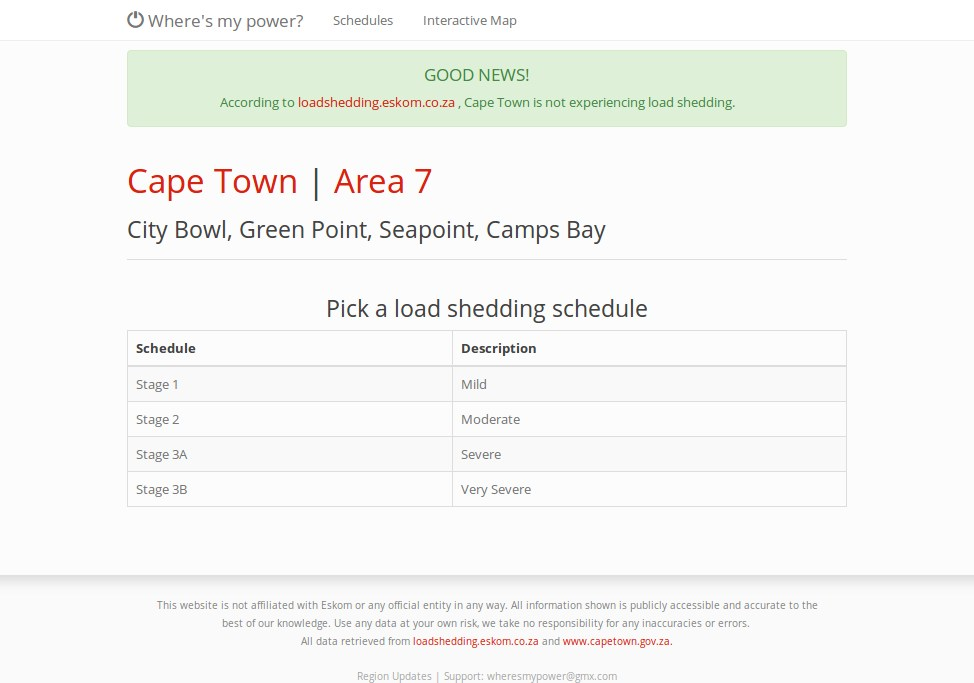
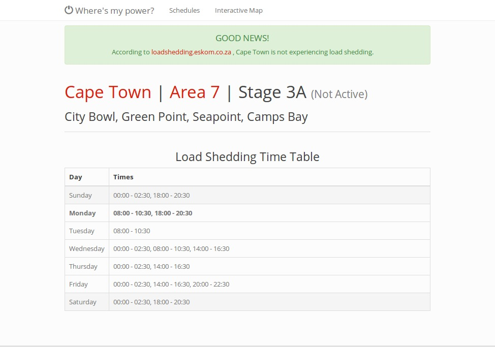
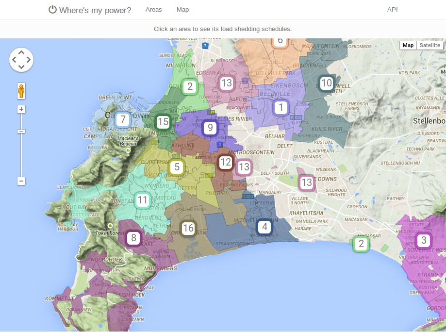

As the screenshots above show, I also added a function that polls the Cape Town city load shedding page to identify when load shedding is actually active. The status is shown in a banner at the top of the page. Tags on the schedule pages also highlight the current time row as well the current stage IF load shedding is underway.

---------------------------------------

At this point it was around the beginning of December 2015 and the website was seeing regular traffic after being shared on Facebook. I wasn't really interested in monetizing it so I didn't add any advertising. I was still using a Heroku subdomain (capetownpower.herokuapp.com) so it was time to migrate to something better. I bought the [whereismypower.co.za](http://whereismypower.co.za) domain (R99) and moved the website to Digital Ocean where I had $100 credit thanks to the Github student pack. These are the only costs so far.

In January, Cape Town announced it would be moving to a new schedule system. This was annoying. The new system was a result of allegations that the previous schedule was unfair and load shed certain areas less than others. It was converted to a monthly schedule and again made available as a pdf:

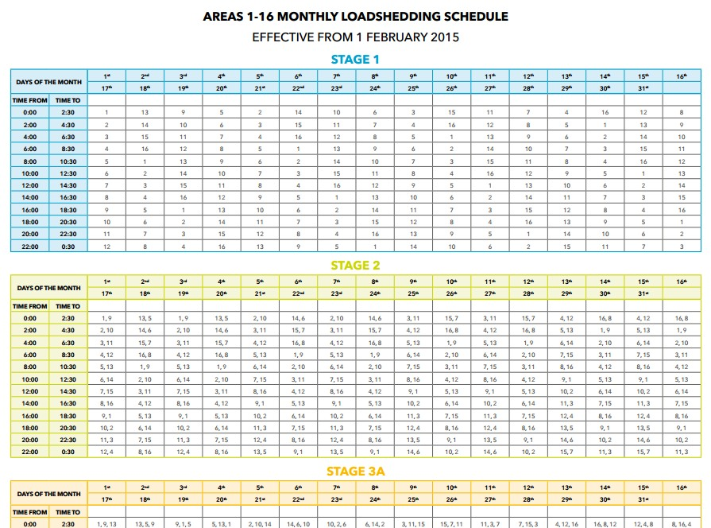

## Data collection v2
The new schedule was substantially more data. It was easy to see that it followed a pattern so I decided to reverse the algorithm that was used to generate it. This was relatively easy and used a set of sliding, repeating ranges that evenly distributed the load shedding across all areas over the entire month.

The algorithm was also posted as a Gist [here](https://gist.githubusercontent.com/AstromechZA/5189b284b7286c8f6301/raw/0269709d78a443d9e1345428f2f588fc8d2a2bac/gen-loadshedding-times):

```
#!/usr/bin/env python
"""
Generate eskom loadshedding schedule v2 for Cape Town
In the following code, 'day' means the day of the month.. 1-31

Author: Ben Meier
Date: 02/02/2015
"""

import sys
import argparse
from datetime import datetime

times = [
    '00:00-02:30',
    '02:00-04:30',
    '04:00-06:30',
    '06:00-08:30',
    '08:00-10:30',
    '10:00-12:30',
    '12:00-14:30',
    '14:00-16:30',
    '16:00-18:30',
    '18:00-20:30',
    '20:00-22:30',
    '22:00-00:30'
]

def gen_stage_areas(day):
    '''
    Generate basic building block:
        which area is loadshed at each time in stage 1
    '''
    if day > 16:
        day -= 16
    i = ((day * 12 - 11) % 16) + (day - 1) / 4
    return [((a - 1) % 16) + 1 for a in xrange(i, i + 12)]

def combinations(day):
    """
    Generate the combinations of stage 1 days used for the given stage 4 day
    """
    m = ((day + 3) / 4) * 4
    return [ (a if a <= m else a - 4) for a in [day, day + 2, day + 1, day + 3]]

def combinations_for_stage(day, stage):
    """
    Cut down combinations to only those required for the current stage
    """
    return combinations(day)[:stage]

def blocks_for_day(day, stage):
    """
    Build list of areas per time for the given stage
    """
    dd = combinations_for_stage(day, stage)
    return zip(*[gen_stage_areas(d) for d in dd])

def times_per_day_per_stage(area, day, stage):
    """
    Determine which times the given stage is being load shed in the given day
    """
    m = zip(times, blocks_for_day(day, stage))
    return map(lambda x: x[0], filter(lambda x: area in x[1], m))

def main():
    parser = argparse.ArgumentParser(description=("Determine Cape Town's load "
        "shedding times for the given area on the given day, with the given stage."))
    parser.add_argument('area', type=int, help='Area code (1-16)')
    parser.add_argument('stage', type=int, help='Loadshedding Stage (1-4)')
    parser.add_argument('--day', type=int, required=False,
                        help='Day of the month. (Default: today)',
                        default=datetime.now().day)
    args = parser.parse_args()

    if args.area < 1 or args.area > 16:
        print 'Error: Area code out of range 1-16.'
        sys.exit(1)

    if args.stage < 1 or args.stage > 4:
        print 'Error: Stage code out of range 1-4.'
        sys.exit(1)

    if args.day < 1 or args.day > 31:
        print 'Error: Stage code out of range 1-31.'
        sys.exit(1)

    for t in times_per_day_per_stage(args.area, args.day, args.stage):
        print t

if __name__ == '__main__':
    main()
```

## New Schema and Features
The new monthly schedule meant a substantial schema change for the database. I had also received requests for an API in order to support other sites or mobile apps. The new schema is more granular and also includes indexes and optimised pre-calculated columns that make more complex queries more efficient.

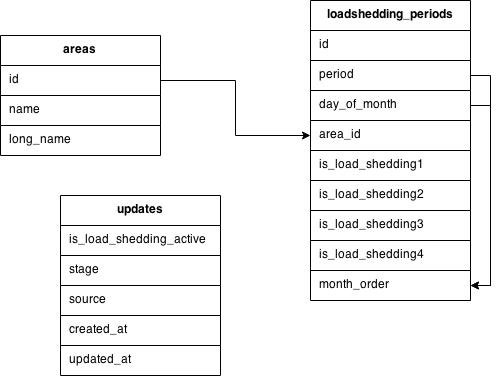

#### New features
- Daily and monthly schedule views
- Printable month schedules
- Backup polling url from official Eskom website
- 3 API calls: 
    + `/api/get_status` to retrieve current load shedding status
    + `/api/list_areas` to list the 16 areas
    + `/api/get_schedule` to retrieve the schedule for the given day, stage, and area.

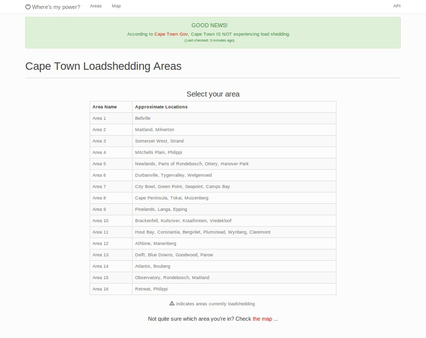
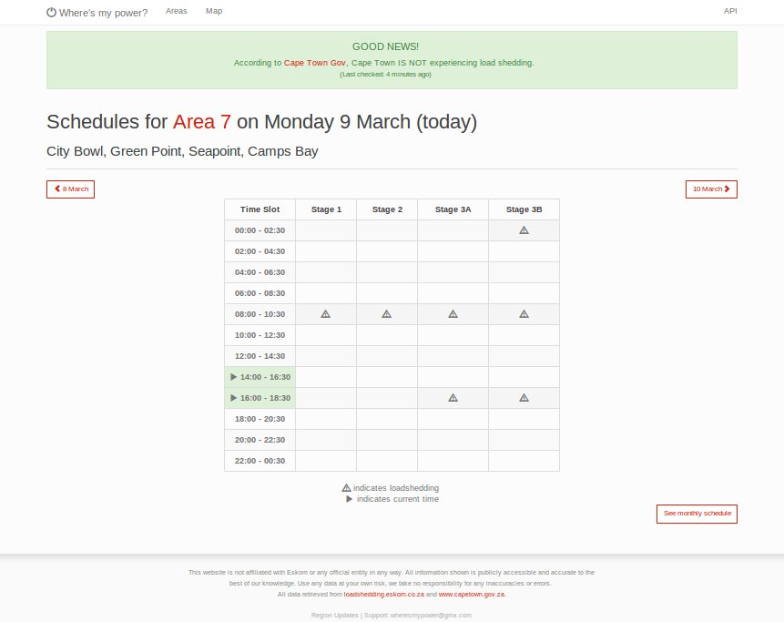
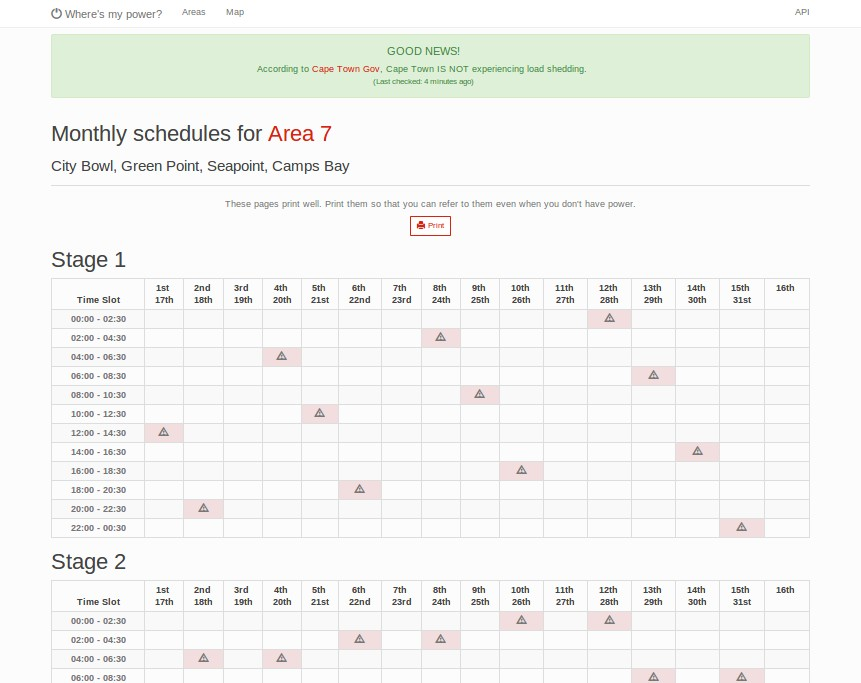
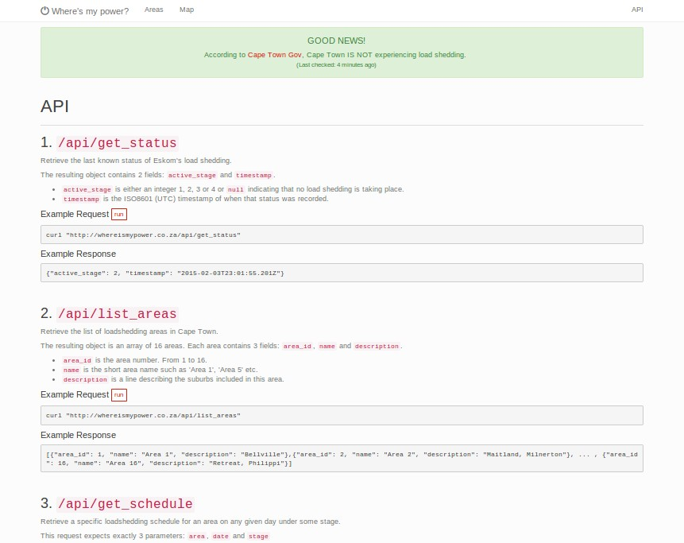

### Wrap up
Since the new schema, not much has changed on the website. Load shedding has become rare due to better national power management, diesel generators, and less down time so in turn page views have dropped off a bit. I've been using Google Analytics to watch the traffic over the last few months and I'll keep it running until no one really needs it anymore.

It was a good experience building a public website that people could use. Adjusting to weird data sets, fixing critical bugs late at night, and keeping the status up to date and reliable were the main issues I faced, but all in all it's been a fun project so far.
