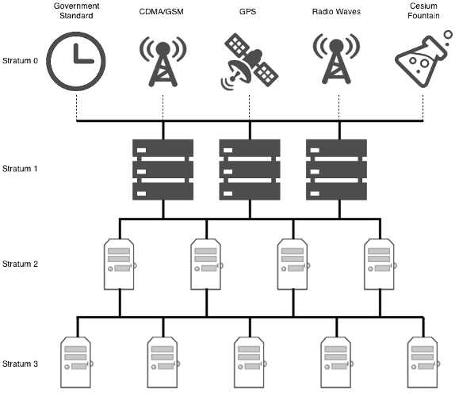
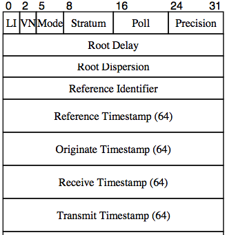

<meta x-title="Building an NTP agent"/>
<meta x-description="(Imported from old blog) Building an ntp synchronisation tool in Go from first principals."/>

My home/media server has a small Grafana instance with a [Spoon](http://github.com/AstromechZA/spoon)
instance collecting and reporting metrics to it (network stats, disk usage, etc..). It's been
running for quite a while now and I've used the stats for a bunch of things so
far. Recently I was adding an additional ping test metric and noticed something
interesting while I was on the server:

```bash
macbook$ date && ssh ben@192.168.1.2 date
Sat Sep 10 10:09:40 SAST 2016       <-- time from macbook
Sat Sep 10 10:17:07 SAST 2016       <-- time from microserver
```

> Oops

The time was REALLY out of sync. I'm not too suprised though. The server isn't
running an NTP update daemon and it's a shitty little microserver which has had
time issues in the past. In the age of NTP, hardware clocks don't *have* to be
as reliable as they could be.

For those that don't know. NTP (Network Time Protocol) is an age old and
time-proven protocol for synchronising a large number of servers clocks. It is
basically structured like a hierarchy of "strata" with a few super-reliable,
super-accurate time sources in "Stratum 0" connected to time servers in
"Stratum 1" with layers of descendent servers in peer-to-peer networks below them.



I started going through the process of looking at how to setup NTP update on
an Ubuntu server, but halfway through that I thought:

> How hard can building an NTP update client be?? It's just getting an accurate
time and pushing your local clock towards that... right?

My knowledge of NTP before this was redimentary: I knew there were hierachies of
time servers but had no idea of the complexity of the communication protocol.
This series of blog posts will hopefully shed some light on that as I work
through building my own NTP client.

--------

### 1. Who are my upstream servers and how do I communicate with them?

Looking at the stratum diagram, my server is in stratum "N". I need to pull time
information from stratum "N-1" or from other peers on the network. Since I don't
have any peers, I'll need to rely on some NTP pool servers. The organisation at
[www.pool.ntp.org](http://www.pool.ntp.org/en/use.html) has a great explanation
of how their pools work and various other considerations and also allows you to
drill down and target specific continent or country local servers.

At the time of writing:

- pool.ntp.org had 2635 servers
- africa.pool.ntp.org had 33
- za.pool.ntp.org had 21

I'm going to be using the `za` pool for my experiments, just to keep latency
down, but it should be completely configurable.

ntp.org allows you to address the pool using the four domains `{0,1,2,3}.za.pool.ntp.org`.
The DNS lease changes quite frequently as the available servers in the pool are chosen for duty.
Each of the servers that those domains resolve to is listening on the NTP port
`123` for NTP packets.

The best description of the NTP protocol I could find was this
[90 page PDF](https://www.eecis.udel.edu/~mills/database/reports/ntp4/ntp4.pdf).
Pretty heavy reading, but the most reliable source I could find that had
text, diagrams, and sample source code for the algorithms.

 It's great that NTP uses UDP since this makes writing a client *much* easier than a TCP protocol.
The simplest UDP client packet that can be sent is almost completely zeroes. The
only filled in fields of the 48 byte packet are the 3-bit version and 3-bit mode
at the start. This outgoing packet will get a little more filled in later. But
this is the minimum required to get a response from an NTP server.

```
00 100 011 0000000000....000
   --- ---
```

For more details of what all the fields mean look at page 11 and 43 of the
pdf.

A quick client in Golang to send an NTP request to multiple upstream servers:

```golang
func getNTP(server string) (*[]byte, error) {
    svrAddr, err := net.ResolveUDPAddr("udp", fmt.Sprintf("%s:%d", server, 123))
    if err != nil { return nil, err }

    conn, err := net.DialUDP("udp", nil, svrAddr)
    if err != nil { return nil, err }

    defer conn.Close()

    buf := make([]byte, 48)
    buf[0] = 0x23
    _, err = conn.Write(buf)
    if err != nil { return nil, err }

    inbuf := make([]byte, 1024)
    n, _, err := conn.ReadFromUDP(inbuf)
    if err != nil { return nil, err }
    response := inbuf[:n]
    return &response, nil
}

...

    for _, server := range flag.Args() {
        r, err := getNTP(server)
        if err != nil {
            fmt.Println(err.Error())
        } else {
            fmt.Printf("%x\n", *r)
        }
    }
```

Nets us:

```
$ ./ntp-blog 0.pool.ntp.org 1.pool.ntp.org 2.pool.ntp.org 3.pool.ntp.org
240203ed00000000000002d67f7f0100db7e4f188fc8c3d00000000000000000db7e4f229dafd5d5db7e4f229dbda7f0
240203e90000066b000004b0c415bb02db7e4eda5d8d01850000000000000000db7e4f23cf980d0edb7e4f23cfa11750
240203e9000003a500000fabc415bb02db7e47a34ad22a210000000000000000db7e4f2410516b24db7e4f241062d562
240303e80000361700000a93c550447bdb7e4e9c7d8d8d450000000000000000db7e4f24f2920ab3db7e4f24f2955cfa
```

Seems legit. Next is parsing those responses.

### 2. Parsing an NTP packet

UDP packets are meant to be as small and reliable as possible and so are
usually packed very densely with information. NTP packets are no different.

The basic 48 byte packet for both the client and the server looks like the
following:



So we just have to setup a data structure (`RawPacket`) and some methods to
encode and decode it to the same 48 byte format.

```golang
type RawPacket struct {
    LeapIndicator byte
    Version byte
    Mode byte
    Stratum byte
    Poll byte
    Precision byte
    RootDelay int32
    RootDispersion int32
    ReferenceID int32
    ReferenceTimestamp int64
    OriginateTimestamp int64
    ReceiveTimestamp int64
    TransmitTimestamp int64
}
```

I'm not going to write all the code inline here. Just capture some of the
important bits. Anything else I'll link to afterwards in the repo for the
project.

```golang
func ParseRawPacket(input *[]byte) (*RawPacket, error) {
    inputData := *input

    // check incoming data length
    if len(inputData) != 48 {
        return nil, errors.New("Incoming packet must be 48 bytes")
    }

    // build output structure
    output := RawPacket{}

    // first byte
    b1 := inputData[0]
    output.LeapIndicator = (b1 >> 6) & 0x2
    output.Version = (b1 >> 3) & 0x7
    output.Mode = b1 & 0x7

    // next 3 bytes
    output.Stratum = inputData[1]
    output.Poll = inputData[2]
    output.Precision = inputData[3]

    // remaining components
    var err error
    output.RootDelay, err = getInt32(input, 4)
    if err != nil { return nil, err }
    output.RootDispersion, err = getInt32(input, 8)
    if err != nil { return nil, err }
    output.ReferenceID, err = getInt32(input, 12)
    if err != nil { return nil, err }
    output.ReferenceTimestamp, err = getInt64(input, 16)
    if err != nil { return nil, err }
    output.OriginateTimestamp, err = getInt64(input, 24)
    if err != nil { return nil, err }
    output.ReceiveTimestamp, err = getInt64(input, 32)
    if err != nil { return nil, err }
    output.TransmitTimestamp, err = getInt64(input, 40)
    if err != nil { return nil, err }

    return &output, nil
}

func getInt32(input *[]byte, position int) (int32, error) {
    ...
}

func getInt64(input *[]byte, position int) (int64, error) {
    ...
}
```

Our struct prints quite reliably now:

```
$ ./ntp-blog 0.pool.ntp.org 1.pool.ntp.org 2.pool.ntp.org 3.pool.ntp.org
{0 4 4 3 3 232 13866 5338 -984595333 -2630542190490089860 0 -2630535662870812375 -2630535662870604122}
{0 4 4 2 3 234 2102 3176 -1005208830 -2630538858014520027 0 -2630535662636034478 -2630535662635204098}
{0 4 4 3 0 236 320 1342 693010449 -2630535707210498351 0 -2630535662448759907 -2630535662448722089}
{0 4 4 2 3 233 3013 1404 3967938 -2630536493219449208 0 -2630535662258047584 -2630535662257932277}
```

### 3. Building a Time object from the 64bit NTP timestamp

The final part of this post is extracting the actual Time value that the NTP
server is transmitting. The format it uses is fairly interesting:

> The 64-bit timestamp format is used in packet headers and other places with limited word size. It
includes a 32-bit unsigned seconds field spanning 136 years and a 32 bit fraction field resolving
232 picoseconds.

I borrowed this technique of doing it from Apache commans library:
[net/ntp/TimeStamp.java](http://svn.apache.org/viewvc/commons/proper/net/trunk/src/main/java/org/apache/commons/net/ntp/TimeStamp.java?view=markup)

```golang
const intMask = 0xFFFFFFFF
const era1900 = -2208988800
const era2036 = 2085978496
const nanosecondsPerSecond = 1e9

func ConvertNTPToSeconds(input int64) float64 {
    // first convert to unsigned
    uinput := uint64(input)

    // get integral seconds
    seconds := (uinput >> 32) & intMask
    // isolate fractions
    fraction := (uinput & intMask)
    // convert into seconds
    extra := float64(fraction) / float64(0x100000000)
    accumulated := float64(seconds) + extra

    // pull the MSB of the seconds
    // if this is set then we are in the next "era"
    msb := seconds & 0x80000000

    // combine with magic offset time depending on the era
    if msb == 0 {
        // after year 2036
        return accumulated + era2036
    }
    // after year 1900
    return accumulated + era1900
}

func ConvertSecondsToTime(input float64) time.Time {
    // pull out the seconds and fractional seconds
    seconds, frac := math.Modf(math.Abs(input))
    // convert to nanoseconds and build
    return time.Unix(int64(seconds), int64(frac * float64(nanosecondsPerSecond)))
}

func ConvertNTPToTime(input int64) time.Time {
    // all together now
    return ConvertSecondsToTime(ConvertNTPToSeconds(input))
}
```

So now we can print out the transmit time stamps of the incoming packets!

```
$ ./ntp-blog 0.za.pool.ntp.org 1.za.pool.ntp.org 2.za.pool.ntp.org 3.za.pool.ntp.org
{0 4 4 2 3 233 1637 1612 -1005208830 -2630533090589107248 0 -2630530882002116997 -2630530882001927291}
2016-09-10 14:24:57.592065811 +0200 SAST
{0 4 4 2 3 234 205 135 692805679 -2630530984411593606 0 -2630530878018216308 -2630530878018054843}
2016-09-10 14:24:58.519639968 +0200 SAST
{0 4 4 2 3 232 14465 2045 -1071249424 -2630534685670322021 0 -2630530876233854186 -2630530876233641078}
2016-09-10 14:24:58.935093879 +0200 SAST
{0 4 4 2 3 237 0 718 2139029760 -2630530886426329555 0 -2630530875228689786 -2630530875227833139}
2016-09-10 14:24:59.169126987 +0200 SAST
```

If you wanted to, you could stop here. Just pick one or average them out, and
set your system clock. If your server is out by multiple minutes and you just
want to get things close enough, this would be perfectly fine for you. The
`ntp4.pdf` document linked earlier suggests this as a minimum implementation
of an SNTPv4 Client:

> 11.2 SNTPv4 Client Configuration:
There is a wide spectrum of SNTPv4 client configurations, with each providing
different levels of accuracy and reliability. Since only local client
applications are supported, to use or not use one or more of the NTPv4
algorithms is a matter of local choice. As a bare minimum, a SNTPv4 client
application constructs a packet with only the version number filled in and sends
it to the NTPv4 or SNTPv4 server. The server operates as in the previous section
to return the packet, but only the transmit timestamp (T3) is useful. The SNTPv4
client application converts from NTP timestamp format to system time format,
sets the system clock to this value and exits. The application can be called at
defined intervals or manually.

The problem is that in complex network environments like the internet, packets
take time, might never arrive, could be arbitrarily delayed, could be maliciously
constructed or highjacked; the remote NTP server might even be completely wrong
or send pure garbage back to you. How you do handle all of these conditions
intelligently? Sure, some basic heuristics about how far you're allowed to change
the clock and by how much could help, but when you want to synchronise clocks
down to the microsecond level or lower you probably need something a bit more
complex.
