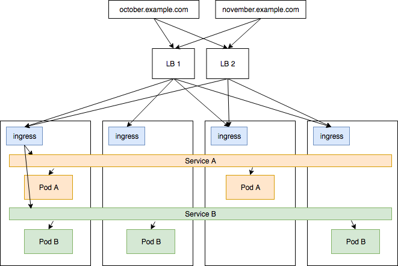

<meta x-title="A Minimal IPVS Load Balancer demo"/>

Over the past couple of days I’ve been investigating various load balancing techniques (Layer 4 and Layer 7) for use with Kubernetes’ (K8s) external load balancers.

For context: in a well deployed cluster, you will probably use a K8s ingress controller implementation to route traffic to particular apps and services using complex L7 routing rules (like Host headers, cookies-stickiness, etc..). However this still means that the TCP connections may be hitting a single node in the cluster if you have DNS set up that way. It is often necessary then to add a external L4 IP load balancer outside of the K8s cluster that balances traffic between all of the node’s running your ingress controller.



There are many services that can do Layer 4 load balancing: Nginx/Nginx Plus, HAProxy, and the one we’ll look at today, IPVS.

IPVS (IP Virtual Service) is a Linux kernel load balancer that has been part of most modern Linux based operating systems using kernel 2.4.x and above. It is based on the Linux netfilter components which are another really interesting aspect of modern Linux networking but a bit too much to get into right now.

You can read more about IPVS in these places:

- [IP Virtual Server](https://en.wikipedia.org/wiki/IP_Virtual_Server) (wikipedia)
- [ipvsadm](http://kb.linuxvirtualserver.org/wiki/Ipvsadm) (man page for cli tool)

The rest of this post will be a quick demo of using IPVS to balance between two docker containers on a machine.

## Demo time

Ingredients required:

- A VM with a publicly accessible IP address that you can SSH into
- Docker installed and configured
- A modern Linux kernel

### 1. Install ipvsadm

I’m using an Oracle Linux 7 UEK4 host with a 4.1.12 kernel.

```
$ sudo yum install -y ipvsadm
```

Note: `ipvsadm` is just the cli tool for interacting with the IP virtual server table in the kernel. `ip_vs` is the kernel module that does the actual connection manipulating.

### 2. Check that the command can be used

Your machine may not have the kernel module loaded or available.

```
$ sudo ipvsadm -l
IP Virtual Server version 1.2.1 (size=4096)
Prot LocalAddress:Port Scheduler Flags
  -> RemoteAddress:Port   Forward Weight ActiveConn InActConn
```   

### 3. Launch 2 nginx Docker containers with some dummy content

Some dummy content will help differentiate between responses once we can make requests against the servers.

```
$ mkdir /srv/A /srv/B

$ echo "This is A" > /srv/A/index.html
$ docker run --rm -d -v "/srv/A:/usr/share/nginx/html" --name nginx-A nginx
$ docker inspect -f '{{range .NetworkSettings.Networks}}{{.IPAddress}}{{end}}' nginx-A
172.17.0.3

$ echo "This is B" > /srv/B/index.html
$ docker run --rm -d -v "/srv/B:/usr/share/nginx/html" --name nginx-B nginx
$ docker inspect -f '{{range .NetworkSettings.Networks}}{{.IPAddress}}{{end}}' nginx-B
172.17.0.4
```

Check that curl works against both servers:

```
$ curl 172.17.0.3
This is A
$ curl 172.17.0.4
This is B
```

### 4. Set up a new IPVS service

Now we can set up a new IPVS service bound to our servers public ip address (eg: 1.2.3.4). We’re going to make it a tcp load balancer using a round robin algorithm ( -t and -s rr ):

```
$ sudo ipvsadm -A -t 1.2.3.4:80 -s rr
$ sudo ipvsadm -l -n
IP Virtual Server version 1.2.1 (size=4096)
Prot LocalAddress:Port Scheduler Flags
  -> RemoteAddress:Port    Forward Weight ActiveConn InActConn
TCP  1.2.3.4:80        rr
```

### 5. Add the Docker container IPs as the “real” hosts

```
$ sudo ipvsadm -a -t 1.2.3.4:80 -r 172.17.0.3 -m
$ sudo ipvsadm -a -t 1.2.3.4:80 -r 172.17.0.4 -m
```

### 6. Issue some requests!

You can do this from the VM itself, or for a more useful example, do it from another machine that can connect to the VM.

```
$ curl 1.2.3.4
This is A
$ curl 1.2.3.4
This is B
```

By default this will use round robin load balancing which will just loop through the list of destinations:

```
$ for i in {1..10}; do curl 1.2.3.4; done
This is B
This is A
This is B
This is A
This is B
This is A
This is B
This is A
This is B
This is A
```

We can change the weighting of one server to see how options could be used to drain or concentrate connections.

First change the scheduling mode to Weighted Round Robin ( wrr )

```
$ sudo ipvsadm -E -t 1.2.3.4:80 -s wrr
```

And then make one node a bit heavier

```
$ sudo ipvsadm -e -t 1.2.3.4:80 -r 172.17.0.3 -m -w 3
```

Now when we do the requests we’ll see the bias in action

```
$ for i in {1..10}; do curl 1.2.3.4; done
This is B
This is B
This is B
This is A
This is B
This is B
This is B
This is A
This is B
This is B
```

### 7. Check out the stats and rates!

Stats are available for the total number of packages and bytes over the lifetime of the servers.

```
$ sudo ipvsadm -L -n --stats --rate
IP Virtual Server version 1.2.1 (size=4096)
Prot LocalAddress:Port    Conns   InPkts  OutPkts  InBytes OutBytes
  -> RemoteAddress:Port
TCP  1.2.3.4:80           80      560     400      36000   41040
  -> 172.17.0.3:80        22      154      110     9900    11286
  -> 172.17.0.4:80        58      406      290     26100   29754
```

Rate information shows a more live view of the values per second.

```
$ sudo ipvsadm -L -n --rate
IP Virtual Server version 1.2.1 (size=4096)
Prot LocalAddress:Port      CPS    InPPS   OutPPS    InBPS   OutBPS
  -> RemoteAddress:Port
TCP  1.2.3.4:80             1      9       6         562     641
  -> 172.17.0.3:80          0      3       2         169     192
  -> 172.17.0.4:80          1      6       4         394     449
```

You can see how this would be a fairly straight forward way to control a TCP load balancer!

This is ideally suited to doing L4 load balancing in front of a Kubernetes cluster’s ingress controllers. This allows the ingress controllers to focus on per-service routing logic (L7) which is arguably much harder to do correctly ourselves.

## Additional Thoughts

### Controlling an IPVS host from Kubernetes

K8s would control and interact with the IPVS host via its cloud controller manager (or a bespoke custom resource, but external load balancers are already a concept in the CCM). The CCM would ensure that the load balancer has the correct K8s node IPs and ports configured for either ingress resources/controllers, specific Node ports, or Service IPs (if these are routable).

### Connection draining between servers

You could use the Weighted Round Robin scheduler to achieve a kind of connection draining effect between two servers O (old) and N(new) in the following manner:

1. Set O.weight to 100
2. Add server N with weight 0(0% of requests)
3. Over an period T at interval I, reduce O.weight and increase N.weight

### Using health checks to remove dead hosts

You could set up your IPVS host to do health checks against the hosts in a particular service and if it finds any of them to be bad or not responding as expected, can set the hosts weight value to 0. Effectively stopping traffic from being sent to that host. Once the healthcheck begins returning correctly, requests can be sent once again to that host.

Your CI/CD setup could preempt this by indicating to the IPVS host that a particular host is going to be unavailable while an app is redeployed.

### Health checks for IPVS

It would be a good idea to have a health check or metrics coming out of the IPVS hosts themselves. Since `ipvsadm` can expose `--stats` and `--rates` these could naturally be included as well as the normal Linux indicators for dropped packets, dropped connections, and inflight connections. This is the place we’d want to be aware of DoS patterns, so you’d want to keep an eye on memory usage and that sort of thing.

Perhaps a little prometheus endpoint could be written help extract these things from `ipvsadm`. Although it looks like the same information is available in raw form from `/proc/net/ip_vs_stats`.

## Related Golang libraries

- https://github.com/mqliang/libipvs (uses netlink?? socket)
- https://github.com/tehnerd/gnl2go/ (also netlink, see here)
- https://github.com/nanobox-io/golang-lvs (just calls ipvsadm commands)
