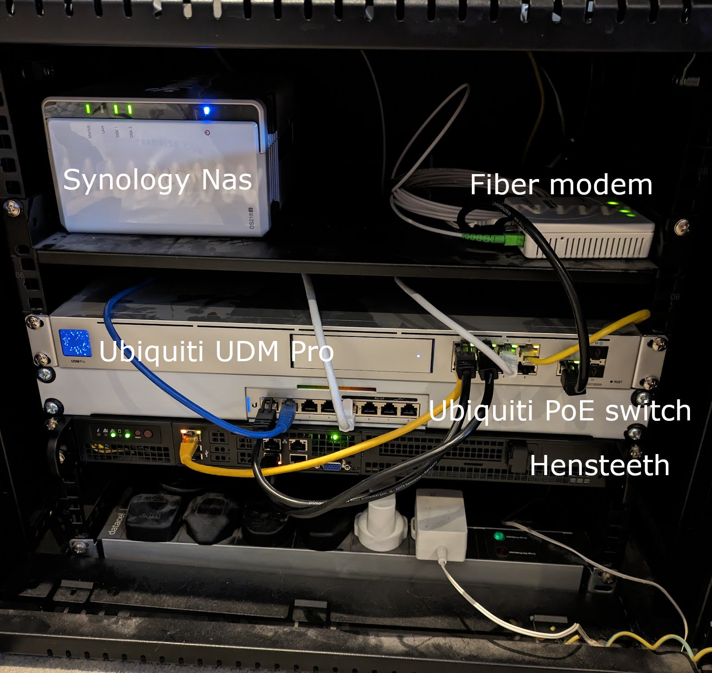
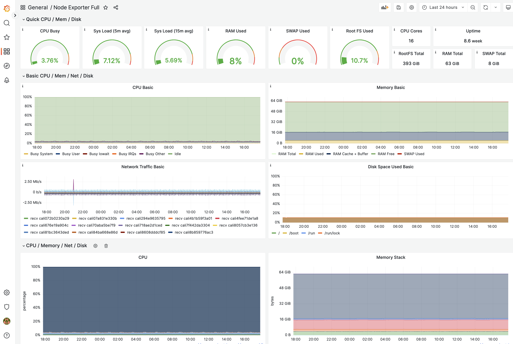

<meta x-title="The 2023 home-lab infrastructure and hen's teeth"/>

I'm a full-stack geek by heart and have always enjoyed owning and running my own hardware and managing things from end-to-end. I've been heavily embroiled in containers, Kubernetes, and "serverless" for some time both at OCI (Oracle Cloud Infrastructure) and now at [Humanitec](https://humanitec.com/), so it was only natural that I wanted a solid and reliable local Kubernetes environment that I could use for self-hosting permanent or completely temporary projects.

**Why self-host and not cloud?**

There are literally tons of options for managed Kubernetes and container ecosystems in the cloud, and many of these have free-tiers! Why on earth would I want to self-host? This is a super valid question and for me, it comes down to local network accessibility and cost. I want to run systems that have local connectivity at home[^1]. And I want to be able to have a fixed cost budget with no major concerns about variable storage, compute, and networking availability or price.

## Hardware

I've had a small (quarter/half?) rack in my office with Ubiquiti network gear, the fibre modem, and a Synology NAS for some time. Which has been nice to dabble with, but I've always felt restricted by not having a good amount of compute and memory to truly mess around with. While there are methods of running docker containers on a Synology NAS, they are quite restricted and hacky and not reliable enough for my use. 

With the goal of having a Kubernetes cluster in the rack, I found a good low power, but horizontally scaled solution: A 16-core Intel Atom motherboard in a 1U chassis:

- [Cyberserve Atom 104f](https://www.broadberry.co.uk/intel-atom-rackmount-servers/cyberserve-atom-104f)
- [Intel C3955](https://www.intel.co.uk/content/www/uk/en/products/sku/97933/intel-atom-processor-c3955-16m-cache-up-to-2-40-ghz/specifications.html)
- 2 x 32GB ECC RDIMMs[^2]
- A 1TB SATA M.2 SSD (Unfortunately the board above can't support NVME natively)
- 2 x [40mm Noctua](https://noctua.at/en/nf-a4x20-pwm) fans to replace the stock ones.

The server and memory came out to around £1300, plugging in similar values to the OCI pricing calculator for a 16-core, 64GB server with 1TB SSD block volume, comes out to around £340 a month. So even if I'm out by a a factor of 2 or 3, running this server myself is relatively cost-effective if I'm still actively using it a year or two from now.

One interesting point is that I intentionally opted for no spinning disks or crazy persistent storage, _yet_. I'm not interested in storing tons of multimedia, but I might add a bit more archival storage in the future if I store backups for things like Google photos/drive at home.

Unfortunately I ended up ordering this while the chip shortage was still in effect, and what should have taken a week or two, took over a month to get to me. Thankfully, it did arrive in the end, but this led to the hostname of the server: `hensteeth` (["as rare as hen's teeth"](https://en.wiktionary.org/wiki/rare_as_hen%27s_teeth)).



## The Kubernetes cluster

Having 16 cores to dabble with gave me a choice: a single-node cluster, or break it up into VMs with nested virtualization and run a 3-node cluster.

While a 3-node cluster might be fun, if it's hosted all on the same hardware I really would not be gaining much. Instead, I'm focusing on simplicity, low overhead, and being able to quickly rebuild the node from scratch if needed.

1. Flash Ubuntu 22.04 LTS onto an old USB driver via [Etcher](https://www.balena.io/etcher).[^3]
2. Install Ubuntu Server, non minimized.
3. Expand LVM volume group, add SSH authorized keys, etc.
4. Install `microk8s` 1.27/stable snap package.
5. Install `tailscaled` and link it to the tailnet.
6. Reboot and ensure K8s and TailScale will start on boot!

In order to allow my K8s hosted applications to persist across server reboots, whether because of OS patching or power problems, I needed a persistent volume solution. Since I'm already using LVM I went with the [TopoLVM](https://github.com/topolvm/topolvm) plugin. This is a CSI plugin that sets up LVM volumes locally on the node and ensures that pods that are bound to a volume or _always_ scheduled back on the same node as that volume. Since I've just got a single K8s node for now, this is perfect and this takes up the rest of the SSD volume. I can easily extend the storage adding more disks to the LVM volume group later.

So far this has been quite successful, and since setting it up I've barely had to SSH in at all - all other interactions are done through the K8s API.

## Helm charts to install

1. [cert-manager](https://artifacthub.io/packages/helm/cert-manager/cert-manager) for Let's Encrypt certificate management. I'm using DNS01 challenges here, with my DNS zone managed in GCP.
2. `lvmd` and [TopoLVM](https://topolvm.github.io/topolvm) for persistent volume management and scheduling.
3. [kube-prometheus](https://github.com/bitnami/charts/tree/main/bitnami/kube-prometheus) as a Prometheus operator
4. [thanos](https://github.com/bitnami/charts/tree/main/bitnami/thanos) for long term telemetry backup to object storage. I want metrics to last longer than a few weeks!
5. [Grafana](https://github.com/bitnami/charts/tree/main/bitnami/grafana/)

(**NOTE** that an nginx ingress controller came pre-configured with microK8s - otherwise I would have installed that explicitly)

Sprinkle in some well-crafted Helm values files to link everything together, and we've got ourselves a fairly stable environment. The major bits here were

1. Let's Encrypt `ClusterIssuer` set up with GCP Cloud DNS solver[^4]
2. Link Grafana ingress to the above issuer
3. Link Thanos to Prometheus and store Thanos to GCP object storage[^4]
4. Setup TopoLVM storage class

Here's a screenshot of Grafana's node exporter metrics.



I generally lay out the namespaces like the following:

- Subject specific, cluster wide, namespaces like `cert-manager`, `topolvm-system`, `kube-*`, `ingress` (for the main Nginx ingress)
- `default` - usually empty
- `experimental` - as a scratch space for testing
- `production` - for things I want running all the time
- `staging` for predeploying and testing things that will be running in the `production` namespace.

## Validation

A good exercise is to run through a couple of what-if and SOP scenarios to make sure things are setup as expected.

### Access K8s API over tailscale

This is important to me, as I need to be able to access the K8s API and services running in the cluster while I'm away from home, and without necessarily exposing them over the internet. 

1. Connect to mobile hotspot
2. Activate Tailscale VPN
3. Ensure that `kubectl` can still connect to the cluster

### Stateful set recovery

Set up an Nginx Pod with 1 replica, and a PVC.

```yaml
apiVersion: apps/v1
kind: StatefulSet
metadata:
  name: web
spec:
  selector:
    matchLabels:
      app: nginx
  serviceName: "nginx"
  replicas: 1
  minReadySeconds: 10
  template:
    metadata:
      labels:
        app: nginx
    spec:
      containers:
      - name: nginx
        image: registry.k8s.io/nginx-slim:0.8
        ports:
        - containerPort: 80
          name: web
        volumeMounts:
        - name: www
          mountPath: /usr/share/nginx/html
  volumeClaimTemplates:
  - metadata:
      name: www
    spec:
      accessModes: [ "ReadWriteOnce" ]
      resources:
        requests:
          storage: 1Gi
```

Write a file inside it

```shell
kubectl exec --namespace experimental --context hensteeth web-0 -- /bin/bash -c 'echo foo > /usr/share/nginx/html/foo.html'
```

And ensure it is viewable

```shell
$ kubectl port-forward --namespace experimental --context hensteeth pod/web-0 5000:80
Forwarding from 127.0.0.1:5000 -> 80
...

$ curl http://localhost:5000/foo.html
foo
```

Power off the server and then turn it on again with the physical power button. For advanced mode, do this through the ILOM.

```
$ sudo poweroff
Connection to hensteeth closed by remote host.
Connection to hensteeth closed.
```

And now wait till the curl succeeds again..

```
$ while true; do kubectl port-forward --namespace experimental --context hensteeth pod/web-0 5000:80; sleep 2; done
...

$ while true; do date; curl http://localhost:5000/foo.html; sleep 2; done
...
```

For me this took about 9 minutes. Which I'm pretty happy with :). In theory this means that I can recover the server and it's workloads while I'm away from home.

### Disaster recovery, aka "What if I _really_ break things"

A more ambitious validation, mostly ensures that you've stored your helm charts somewhere that you can redeploy them with the same configuration!

1. Ensure you can access some persisted state (eg: Grafana dashboards)
2. `sudo rm -rf /var/snap/microk8s/current/var/kubernetes/backend/`
3. `sudo reboot`

The challenge here is to clean and reinstall microk8s, redeploy Helm charts, and then identify the old LVM volumes (which should still exist) so that you can copy content back over to the new LVM volumes of the new persistent volumes.

## What's next?

I'm generally happy with this. The main things I'd like to add in the future, hardware wise, are mostly nice-to-haves:

- Some kind of in-rack 1U UPS (uninterruptible power supply) to smooth any power noise, measure power usage, and power the gear for some time while I shut it down cleanly or work on the electrics.
- Some larger spinning disks in a RAID array so that I can make them the primary storage location with cloud backups as the fallback. 

**Footnotes:**

[^1]: Yes, things like Tailscale and wireguard exist. But some IOT devices I'm working with won't be able to join those kinds of networks in order to talk to services in the cluster.

[^2]: https://www.mrmemory.co.uk/all-products/32gb-ddr4-pc4-19200-2400mhz-288-pin-rdimm-ecc-registered. I can't quite remember what brand the chips were in the end ¯\_(ツ)_/¯

[^3]: Ubuntu LTS + MicroK8s is a pragmatic choice. I don't particularly want to mess around with install K8s myself, although I have done that before, and I want to use a Linux distro which is easy enough to maintain and troubleshoot.

[^4]: I currently use Google Cloud DNS to manage my personal DNS zones and for object storage backups for things like Thanos metrics and the like. I could move this to any of the major cloud providers if I need to in the future.