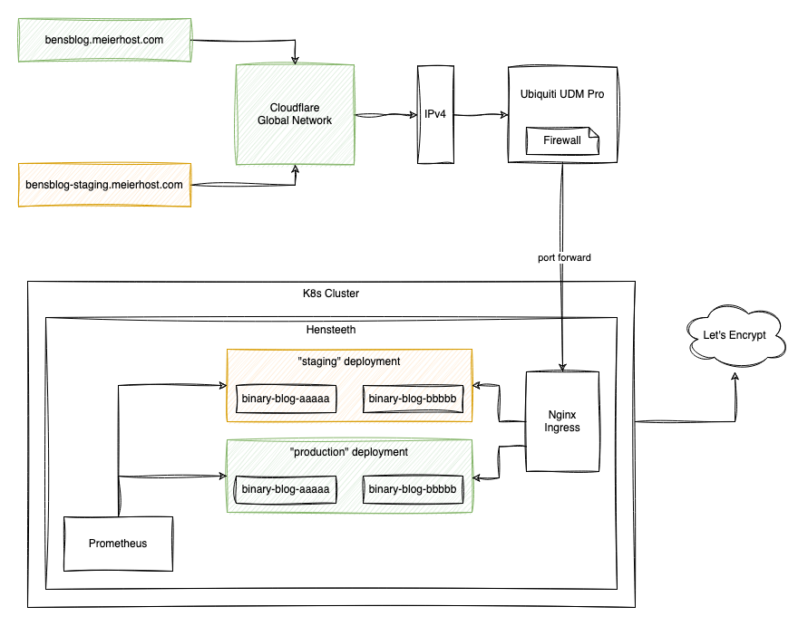
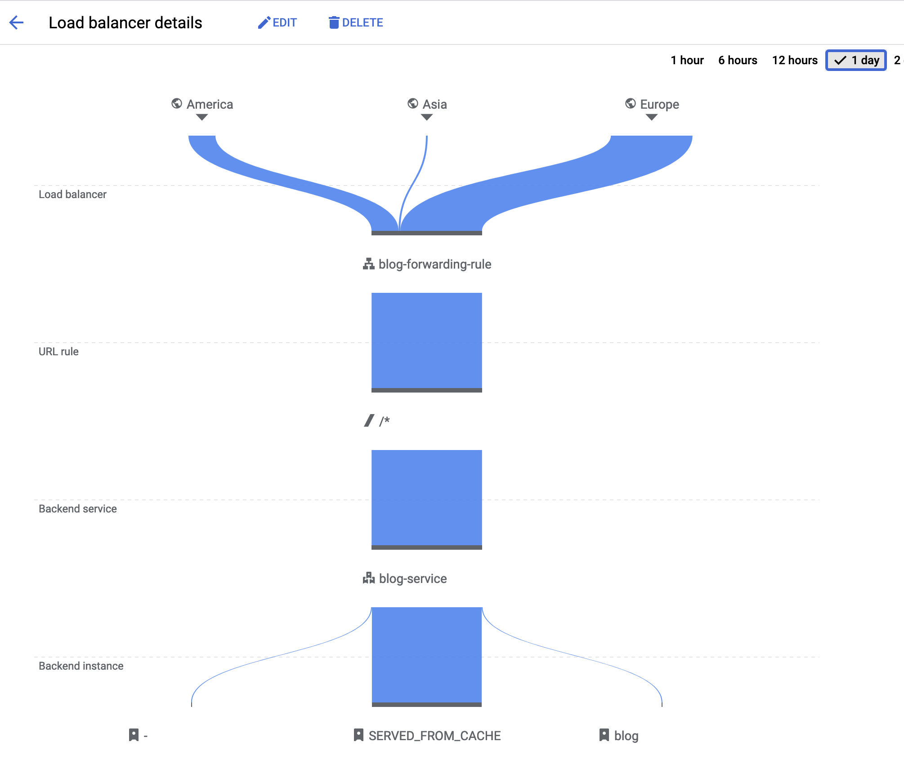

<meta x-title="A binary blog"/>

I've been interested in learning Rust (the programming language) for some time. As someone that enjoys reasoning and building distributed systems and looking at formal verification, the memory model of Rust intrigues me! So since I was looking at self-hosting my blog, I thought it may be a great excuse to tie together a number of things into one project:

1. Learn and use Rust for a relatively complex project
2. Statically compile and render markdown-based blog posts with customised CSS, HTML to style it exactly how I'd like to
3. Self-host it at home on the [Hensteeth Server](../20230705-home-lab-infrastructure).
4. Expose the blog through a CDN to make it safe for exposing on the public internet.

## The code

Most of the challenge here was to get as much as possible pre-rendered at compile time or at least at server start. Shout out to `lazy_static` and `Cow<'static, [u8]>` 🙌.

At compile time:

1. Use [rust_embed](https://docs.rs/rust-embed/latest/rust_embed/) to store the directory of blog posts, css, and images in the binary.

And at run time:

1. Parse CLI arguments with [clap](https://docs.rs/clap/latest/clap/).
2. Gather blog posts from the embedded directory, parse them as markdown, and extract metadata like publish date, Etag, and the title of the post. I use [maud](https://docs.rs/maud/latest/maud/) for markdown parsing.
3. Pre render HTML for each post as well as for the index, the `404` page, and the `robots.txt`.
4. Setup prometheus monitoring with some basic counters.
5. Use [axum](https://docs.rs/axum/latest/axum/) as a web server and host the various routes including live-ness and readiness endpoints.

Since everything is pre-rendered, serving requests is fast since everything is in memory already and can be copied to the output relatively fast with minimal translation. By supporting `Cache-Control` headers and `If-None-Match` and `Etag`, we can try to persuade browsers to only pull content when needed.

The CSS, based on [milligram](https://milligram.io/), is compiled into one document and inlined into the page since it's only about 6 kB.
Similarly the favicon is base64 encoded and inlined in the HTML head.

All in all, it's super fast and light weight and doesn't look half-bad. It gets built into a tiny Docker image and Helm chart by the Github CI pipeline.

## Hosting

The blog is hosted in a production and "staging" configuration on the [Hensteeth Server](../20230705-home-lab-infrastructure) cluster. The staging configuration is mostly used for proof reading before the image is promoted to the primary hostname.

It's best to understand as a diagram:

The global load balancer is important to me as it gives the blog edge-style caching, with HTTP-to-HTTPS redirection without putting my home IP address right at the cliff face. This unfortunately incurs the main cost of the project: it relies on 1 or 2 static IP addresses set up for any-cast to the GCP endpoints.

Certificates on the LB are done with Googles certificate management and DNS challenges.

I've been using GCP here because thats where I've had by DNS zone hosted in the past, and the global load balancer was attractive. Unfortunately, I've been finding some of the GCP experience, especially around monitoring and metrics, quite poor so I'm probably going to look towards a different solution in the future. It won't be Cloudflare, and BunnyCDN lacked a good solution for allow-listing the incoming ip range between the CDN and my home router. Thankfully as everything is set up with Terraform it's relatively easy to move!

## Next steps

- I've chosen to have no client side monitoring or tracking, which is great but it means I need to spend some time building a dashboard or tool to pull data out of the Google monitoring stack so that I can figure out hits per blog post.

- Evaluate costs and check if another CDN solution is needed, although I'll only be able to figure this out after a few months.

- Continuous delivery. I'm currently deploying it manually with a `helm upgrade` call once the PR has merged into main on Github and the CI pipeline has run, but that sucks! I'd like to get it at least automatically promoted to staging. This is complicated because Github Actions can't easily reach out to my K8s cluster. I may need to do something more custom here.

- Write more content!
