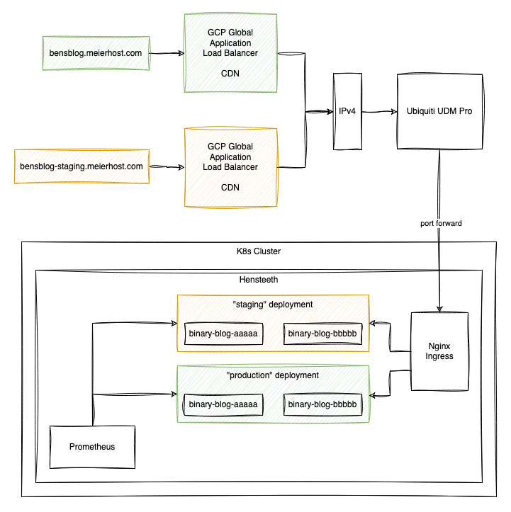

<meta x-title="A binary blog"/>

**Edit 2023-09-23:** _The first version of this blog described using GCP as a global application load balancer. This ended up being too expensive for more liking and I went back to Cloudflare - and updated this post to describe that layout._

I've been interested in learning Rust (the programming language) for some time. As someone that enjoys reasoning and building distributed systems and looking at formal verification, the memory model of Rust intrigues me! So since I was looking at self-hosting my blog, I thought it may be a great excuse to tie together several things into one project:

1. Learn and use Rust for a relatively complex project
2. Statically compile and render markdown-based blog posts with my own CSS, and HTML to style them exactly how I'd like to
3. Self-host it at home on the [Hensteeth Server](../20230705-home-lab-infrastructure).
4. Expose the blog through a CDN to make it safer for exposure on the public internet.

## The code

Most of the challenge here was to get as much as possible pre-rendered at compile time or at least at server start. Shout out to `lazy_static` and `Cow<'static, [u8]>` 🙌.

At compile time:

1. Use [rust_embed](https://docs.rs/rust-embed/latest/rust_embed/) to store the directory of blog posts, CSS, and images in the binary.

And at run time:

1. Parse CLI arguments with [Clap](https://docs.rs/clap/latest/clap/).
2. Gather blog posts from the embedded directory, parse them as markdown, and extract metadata like publish date, Etag, and the title of the post. I use [Maud](https://docs.rs/maud/latest/maud/) for markdown parsing.
3. Pre-render HTML for each post as well as for the index, the `404` page, and the `robots.txt`.
4. Set up Prometheus monitoring with some basic counters.
5. Use [Axum](https://docs.rs/axum/latest/axum/) as a web server and host the various routes including live-ness and readiness endpoints.

Since everything is pre-rendered, serving requests is fast since everything is in memory already and can be copied to the output relatively fast with minimal translation. By supporting `Cache-Control` headers and `If-None-Match` and `Etag`, we can try to persuade browsers to only pull content when needed.

The CSS, based on [milligram](https://milligram.io/), is compiled into one document and inlined into the page since it's only about 6 kB. Similarly, the favicon is base64 encoded and inlined in the HTML head. Everything is served with optional `deflate` compression. It gets 100% on both Google's [PageSpeed Insights](./pagespeed.png.webp) and [GTMetrix](./gtmetrix.png.webp) which is a bit unnecessary for a static read-only webpage, but worth keeping an eye on.

All in all, it's fast and lightweight and doesn't look half-bad. It gets built into a tiny Docker image and Helm chart by the GitHub CI pipeline.

### Webp image compression

I use a Makefile to ensure images have a [webp](https://developers.google.com/speed/webp) compressed alternative. Webp supports transparency and is always typically 3x smaller than PNGs and 25% smaller than JPEG. 

```Makefile
IMAGE_FILES = $(shell find $(PWD)/resources -type f -name *.jpeg) $(shell find $(PWD)/resources  -type f -name *.png) $(shell find $(PWD)/resources  -type f -name *.jpg)
WEBP_FILES = $(addsuffix .webp,$(IMAGE_FILES))

$(WEBP_FILES): $(basename $@)
	cwebp $(basename $@) -o $@ -q 80

## Generate webp variants of all images
.PHONY: generate-webp
generate-webp: $(WEBP_FILES)
```

## Hosting

The blog is hosted in a production and "staging" configuration on the [Hensteeth Server](../20230705-home-lab-infrastructure) cluster. The staging configuration is mostly used for proofreading before the container image is promoted to the primary hostname.

It's best to understand this as a diagram:



I'm using Cloudflare as the global router and proxy in front of my home IP address (with a Let's Encrypt certificate on my end). Limiting the ingress on the firewall to just Cloudflare's proxy addresses helps to keep things secure here - and I can trust Cloudflare to keep the public HTTPS side of things tidy.

I had previously used GCP for all of my DNS and the global application load balancer for this blog however this quickly became quite expensive due to mounting DNS and Networking costs (in the £40/month range). Shifting all DNS records and proxy'ing to Cloudflare has made this considerably cheaper.

Everything is set up with Terraform with any secrets (API keys) stored in a `1password` vault.

## Next steps

- Write more content!
