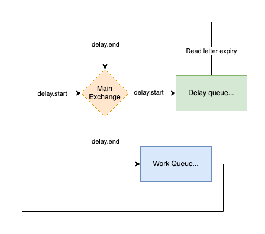
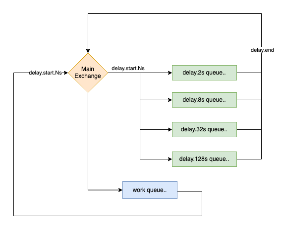

<meta x-title="Building arbitrary delay queues on RabbitMQ"/>

I've been doing a bunch of work on actor-style controllers and job processing over the last few years, and one of the common things that comes up is the need to back off and retry a job:

1. Pull the current state of the task from the queue
2. Attempt to transition the state machine - **but hit an error!**
3. Put the item back on the queue for retry following an exponential backoff strategy

Note that (3) is analogous to emitting the original state change notification with an artificial delay.

When building these mechanisms in-process in Java in the past, we built on the [`DelayQueue`](https://docs.oracle.com/en/java/javase/17/docs/api//java.base/java/util/concurrent/DelayQueue.html):

> An unbounded blocking queue of Delayed elements, in which an element can only be taken when its delay has expired. The head of the queue is that Delayed element whose delay expired furthest in the past. If no delay has expired there is no head and poll will return null.

However we need a shared queue when doing this across multiple processes, and an in-memory solution leads to duplicate work and a higher chance of race conditions.

## Using RabbitMQ as a delay-queue

The AMQP protocol has some very interesting mechanisms we can use to achieve the behaviour.

1. A queue can have a `x-dead-letter-exchange` defined. When a message is discarded or dropped it will be broadcast on the target exchange. [Read more here](https://www.rabbitmq.com/dlx.html).
2. A queue can have a fixed `x-message-ttl` defined. If the message isn't consumed before this ttl expires, the message will be discarded or sent to the dead letter queue. [Read more here](https://www.rabbitmq.com/ttl.html).
3. A queue can have a fixed `x-dead-letter-routing-key` defined. Any message will go to the dead letter exchange with this routing key. 
4. Messages can _also_ have an expiry defined, on a per-message basis.

At first glance, it may seem that all we need is to throw everything onto a "delay" queue with custom TTLs, and move any dead-lettered messages back onto our main exchange.

**However**, there is one issue here which comes down to how expiry on an AMQP queue works: items are _always_ delivered in order. Only the "head" item is ever eligible for consumption and items cannot be re-ordered.

This means that an item at the head of the queue will block the expiry of any items behind it so this will only be valid if every item has the same fixed expiry period when added to the queue.

## Solving the arbitrary delay

To provide arbitrary delay, we have to do something more interesting by combining multiple delay queues.

If we have a queue with a fixed delay of 2 seconds, and we want to delay by 5 seconds, then we must put it back onto the queue at least twice to ensure we have delayed for at least the required time.

We can do this by storing a custom `x-remaining-delay-seconds` header on the message and allowing our work queue to put items back onto the delay queue if there is still a remaining delay on the message.

For example:

1. A message is put onto the `2s` delay queue with `3s` remaining delay.
2. The message goes back onto the main work queue and is processed: the main worker publishes the message back onto the `2s` delay queue with `1s` remaining delay.
3. Repeat until the remaining delay is < 0.
4. Finally, the message goes back onto the main work queue with no remaining delay and can be processed.

One problem here is that this can cause a high degree of message churn and IO if the total delay is large. To optimise this, we can set up multiple delay queues with a factor (`N`) increase between them:

- A 2-second delay queue (the delay of the smallest queue is the smallest accuracy resolution).
- A 8-second delay queue.
- A 32-second delay queue.
- A 128-second delay queue.
- Etc. (I'm illustrating a `N=4` factor here).

This means a message will only be on each queue at most N-1 times: To build 255 seconds we have to do `128 + 32 + 32 + 32 + 8 + 8 + 8 + 2 + 2 + 2 + (2)`.

Since queues are quite cheap in RabbitMQ, we can do this:

## Making it reliable

By moving these delays from in-memory to a shared RabbitMQ queue, we can take advantage of some of the persistence features:

1. Make the queues durable - and turn on Quorum mode if it's clustered.
2. Set a maximum queue size.
3. Use manual acknowledgements for consumers and publishers and ensure that the consumer doesn't ack the message until any next message production is successful.

## Alternatives

I find this neat, but you might find it fragile and risky to set up and maintain which is totally fair. You could consider instead:

1. Use a plugin that does this for you! If you can and want to manage RabbitMQ plugins, have a look at the [RabbitMQ delayed-message-exchange plugin](https://github.com/rabbitmq/rabbitmq-delayed-message-exchange).

2. Use a different queue that offers delayed messages out of the box, like [Amazon SQS Delay Queues](https://docs.aws.amazon.com/AWSSimpleQueueService/latest/SQSDeveloperGuide/sqs-delay-queues.html), or [Apache ActiveMQ](https://activemq.apache.org/delay-and-schedule-message-delivery).

👋
