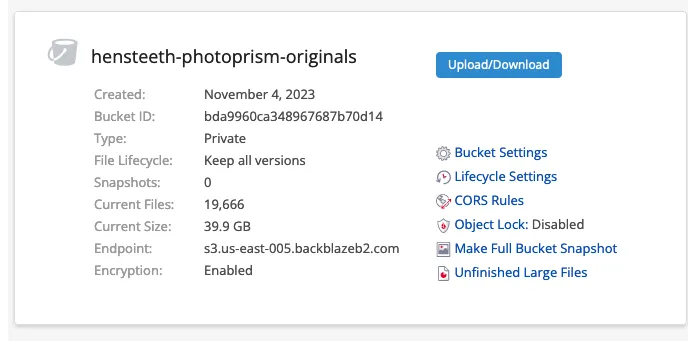

<meta x-title="Data storage on Hensteeth"/>

To divest myself of Google Photos and Drive I've been shifting a bunch of my use over to applications on [my home lab server called Hensteeth](../20230705-home-lab-infrastructure). But this means I've needed to work out a reliable data storage, backup, and restore strategy!

As a reminder, this server only had 1 general purpose m.2 1TB drive at the time. This worked, but I wasn't super happy with it because it was also the OS drive and would hold a spectrum of data of different levels of importance.

I needed a more purposeful approach for reliable data storage.

One of the goals of this project has been to be pragmatic, prudent, and lean. I don't need crazy amounts of data storage or insane performance (I'm not storing video media here or needing to stream or transcode it either). The motto has also been _"Reproducibility rather than redundancy"_. In this vein, I rely more on being confident that I can rebuild the system from scratch rather than trying to make it overly reliable or redundant. 

However, for stuff like family documents and photos - you really can't recreate those - some due diligence is needed! Along with that, I needed a place to store SQL backups from MariaDB that back a lot of the metadata and configuration.

## The storage class

So I chose a simple approach of 2 SSDs in RAID 1 (Mirrored), LVM as a volume manager, and remote filesystem backups for any important logical volumes within it.

For the SSDs, nothing special: 2 [Samsung EVO 870 4TB SSDs](https://www.samsung.com/uk/memory-storage/sata-ssd/870-evo-4tb-sata-3-2-5-ssd-mz-77e4t0b-eu/). These were set up in LVM and then added to the Kubernetes as a new TopoLVM storage class:

```
...
storageClasses:
  - name: topolvm-provisioner
  	...
  - name: topolvm-mirrored-provisioner
    storageClass:
      fsType: xfs
      isDefaultClass: false
      volumeBindingMode: WaitForFirstConsumer
      allowVolumeExpansion: true
      reclaimPolicy: Retain
      additionalParameters:
        "topolvm.io/device-class": "mirrored-vg"
```

Now any pod that needs storage with some redundancy can target it's PersistentVolumeClaim against the `topolvm-mirrored-provisioner` class 🎉.

In theory, I can lose a drive, repair the array, and not lose data.

## Scheduled backups

I went directly to Backblaze B2 for the actual remote backup storage. It just works and they have so many integrations with apps and CLI tools for backing up filesystems or volumes.

To perform the backups, I looked at several options:

1. Taking snapshots in LVM, and backing them up by Hostpath
2. Using the Kubernetes Snapshot Controller
2. Adding a sidecar to the appropriate stateful apps to backup the mounted file system
3. Mounting the same data volumes into new pods on the same node and backing up the mounted file system

### Host-mounted LVM Snapshots

This was an interesting approach. By leveraging LVM snapshots you can theoretically:

1. Snapshot a volume to a new volume name with `lvcreate`
2. Mount it onto the host filesystem again
3. Run a backup pod in Kubernetes with the filesystem mounted as a host path

This was the first approach I took, to make sure the Backblaze config for [rclone](https://rclone.org/) worked as expected. This captured the first backup of one of the chosen volumes.

However, I ended up avoiding this approach because it required a bit too much scripting and the use of privileged command execution.

### Kubernetes CSI Snapshot Controller

The Kubernetes [CSI](https://kubernetes-csi.github.io/docs/introduction.html) defined interfaces for snapshotting and cloning Persistent Volumes. These interfaces and CRDs are managed by the [Snapshot Controller](https://kubernetes-csi.github.io/docs/snapshot-controller.html) addon.

This would allow for:

1. Create a VolumeSnapshot
2. Create a new PersistentVolume based on the snapshot
3. Mount the new PersistentVolume into the backup pod
4. Tear them all down again when the backup has been taken

This option was great because in theory it was very Kubernetes native, and like the previous approach it ensured that I couldn't damage the source data during the backup process.

Unfortunately, the [https://github.com/topolvm/topolvm](Topolvm) CSI driver I use doesn't officially support snapshotting. And the snapshotting it does provide is only for "thin pool" LVM volumes! Which I'm not using here!

I decided that migrating to thin pool volumes and then relying on unsupported and undocumented behaviour for backups was probably not wise.

### Adding a sidecar with the backup process

Unfortunately, this was impractical because I use public Helm charts for most of the components I wish to backup, and adding additional pods to existing Helm charts is a pain to maintain.

### Mounting the data volumes twice

And finally, the approach I settled on. Since I'm using host-native persistent storage and all of the consumers are on 1 physical host, there's no problem with mounting a `ReadWriteOnce` PersistentVolume into multiple pods. Especially if I'm careful about who's reading and writing it.

This is much simpler: 

1. Choose a target Persistent Volume
2. Create a new CronJob template with a backup pod with the appropriate volume set up to consume the existing PersistentVolume
3. Mount in a configmap with the Rclone config file containing Backblaze credentials
4. The CronJob executes

	```
	rclone sync /volume remote:<bucket name> --fast-list --transfers=32 -v
	```

Since CronJobs store success and failure information, this also gives me a handy backup history to show when last it took a successful backup.

Now in Backblaze, I get the bucket statistics showing the successful backup:



## SQL Backups

I use the [MariaDB Operator](https://github.com/mariadb-operator/mariadb-operator/tree/main) to provision SQL databases for some things.

Backing this up would normally be a bit challenging because the filesystem of a SQL database can be a fairly tricky thing to restore from.

**Thankfully** one of the best features the operator provides is the `Backup` CRD. This does a timestamped SQL backup to a file on a new PersistentVolume and will even do it on a schedule automatically via a CronJob.

So it's straightforward to use the same volume backup process to then move these SQL backups up into Backblaze. Both volume and SQL backups happen daily.

## Conclusion

I'm quite happy with this approach. It's very clean and easy to understand, describe, and debug. Monitoring it is as easy as pulling in the Kube State Metrics for the backup cronjobs which I already have in the Grafana/Thanos portal and adding email alerts around their absense.

Backblaze B2 is a well-understood and well-supported provider so I'm confident my backups aren't just going to be randomly lost.

I'm also more free to experiment with more home lab ideas since I know that even if I do break something, I have all the Terraform, Helm charts, and Kubernetes manifests, to bring things up, along with the backups in Backblaze to import again.

Thanks for reading!
