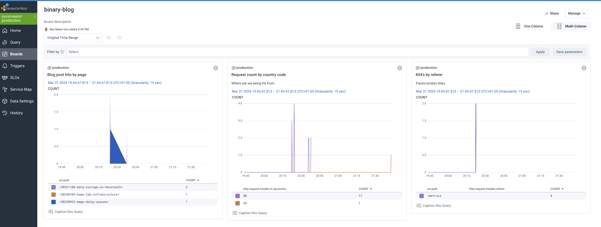

<meta x-title="Moving this blog from Prometheus to OpenTelemetry + Honeycomb"/>

I've been putting a bunch of thought recently into my own idea of an "ideal" tech stack for starting a new project, SaaS, small business, or similar. One of the entries in the table has been "Observability" - and by that I don't mean specifically logs and metrics but rather, how would you answer questions about the operational health or debug issues effectively? And critically, while sticking to open protocols and standards. 

Traditionally, we've always thought of this as metrics and logs. Then this expanded to cover traces, and distributed tracing (Google Dapper 2010 and Twitter Zipkin around 2012). Metrics and timeseries DBs evolved from Graphite, Statsd, towards InfluxDB and Prometheus. Logs moved towards the ELK (Elastic, Logstash, Kibana). Vendors popped up, like Fluentbit, Datadog, Newrelic, etc.

Now, the market for metrics, logs, and tracing is super-saturated with MANY vendor specific protocols and SDKs that lead to a high degree of lock-in, and complex cardinality and indexing rules where an incorrect configuration or label can lead to a very unfortunate wallet-related injury.

So two things have popped up that I've been meaning to look at:

1. **The [OpenTelemetry](https://opentelemetry.io/) project and SDKs** - high quality and portable observability APIs.
2. **[Honeycomb](https://www.honeycomb.io)** - an observability product which _encourages_ high cardinality data feeds and moves away from the traditional view of metrics, logs, and traces as separate things and views them instead as generic inter-related "events".

## The patient

This blog has been running as a Rust binary with a basic Prometheus API and simple http metrics. You can read more about it in [A Binary Blog](/20230706-binary-blog/). I never really liked this as it took way too many steps to expose the data (Kubernetes service monitor, Prometheus, Thanos, Grafana, ...) and when I did get the data it didn't have the cardinality I wanted: I couldn't easily access raw headers, uris, user agents, etc.

So it serves an ideal patient for an observability transplant: remove the prometheus endpoint, and export via OpenTelemetry to Honeycomb.

## The changeset

I initially tried using [libhoney-rust](https://crates.io/crates/libhoney-rust) and [tracing-honeycomb](https://crates.io/crates/tracing-honeycomb) - no opentelemetry, just a Rust SDK for Honeycomb. This worked pretty well and was a good way to get familiar with things but didn't accomplish the goal of using OpenTelemetry.

So I started again and moved on to the open telemetry libraries in `Cargo.toml`:

```toml
tracing-opentelemetry = "0.23"
opentelemetry-otlp = { version = "0.15" , default-features = false, features = ["trace", "http-proto", "reqwest-client"] }
opentelemetry = { version = "0.22" , default-features = false, features = ["trace"]}
opentelemetry_sdk = { version = "0.22" , default-features = false, features = ["trace", "rt-tokio"]}
reqwest = "0.11"
```

I'm using specific versions here that have the right alignment of Traits, and removing some default features that introduced unnecessary dependencies. I was having trouble using the GRPC + tonic variant, so I stuck with the HTTP endpoint.

Then the tracer setup in the code went back and forth for a bit until I arrived at a few major parts in [`36270106`](https://github.com/astromechza/binary-blog/commit/36270106327e016a6904225427091ff6602be2b2).

First, some configuration for Honeycomb:

```rust
let otlp_endpoint = "https://api.honeycomb.io";
let otlp_headers =
    HashMap::from([("x-honeycomb-team".into(), api_key.trim().to_string())]);
let otlp_service_name = args
    .external_url_prefix
    .clone()
    .unwrap_or("unknown".to_string())
    .replace("://", "-")
    .replace(&['.', '/'], "-");
```

These inputs are used to build an OpenTelemetry tracing pipeline with a batch exporter on an async Tokio thread.

```rust
let tracer = opentelemetry_otlp::new_pipeline()
    .tracing()
    .with_exporter(
        opentelemetry_otlp::new_exporter()
            .http()
            .with_endpoint(otlp_endpoint)
            .with_http_client(reqwest::Client::default())
            .with_headers(otlp_headers)
            .with_timeout(std::time::Duration::from_secs(5)),
    )
    .with_trace_config(opentelemetry_sdk::trace::config().with_resource(
        opentelemetry_sdk::Resource::new(vec![opentelemetry::KeyValue::new(
            "service.name",
            otlp_service_name,
        )]),
    ))
    .install_batch(opentelemetry_sdk::runtime::Tokio)
    .unwrap();
```

This then gets included in the tracing subscriber registry.

```rust
let subscriber = tracing_subscriber::registry::Registry::default()
    .with(tracing_subscriber::filter::LevelFilter::INFO) // filter out low-level debug tracing (eg tokio executor)
    .with(tracing_subscriber::fmt::Layer::default()) // log to stdout
    .with(tracing_opentelemetry::layer().with_tracer(tracer)); // traces can go to open telemetry
tracing::subscriber::set_global_default(subscriber)
    .expect("failed to set tracing subscriber");
```

At this point, we have an exporter that will collect batches of `tracing` Span events and send them over OpenTelemetry to Honeycomb. This happens after each one is logged in the application logs as a backup.

I chose to use the `tower_http` middleware to build the span, the most interesting part of which was following the OpenTelemetry conventions on field names which can be found at <https://github.com/open-telemetry/semantic-conventions/blob/main/docs/http/http-spans.md>. The biggest wins here compared to the previous Prometheus labels were:

- Tracking `uri.path` as the raw path, without worrying about cardinality. Previously I could only use the route pattern as the label making it more difficult to track access to individual pages.
- Tracking the `http.request.header.referer`, `http.request.header.x_forwarded_for`, and `http.request.header.cf_ipcountry` to provide some insight into where traffic is coming from and why.
- Using the `user_agent.original` to track what kinds of devices are viewing the blog.

Culminating in some dashboards in Honeycomb:



## Wins

- Some experience with OpenTelemetry tracing. Valuable for the future.
- Using something other than Prometheus. It's nice to go back to a push-based observability platform with less relience on local scraping and cardinality issues.

## Gotchas

- A bit of a mess of dependencies. Multiple different opentelemetry libraries, each with different features, and incompatible versioning. Many of the libraries are still verison 0.X and so don't have the same semver behavior I'd usually want.
- Opentelemetry GRPC to Honeycomb was a struggle and was difficult to debug. HTTP was MUCH easier.


